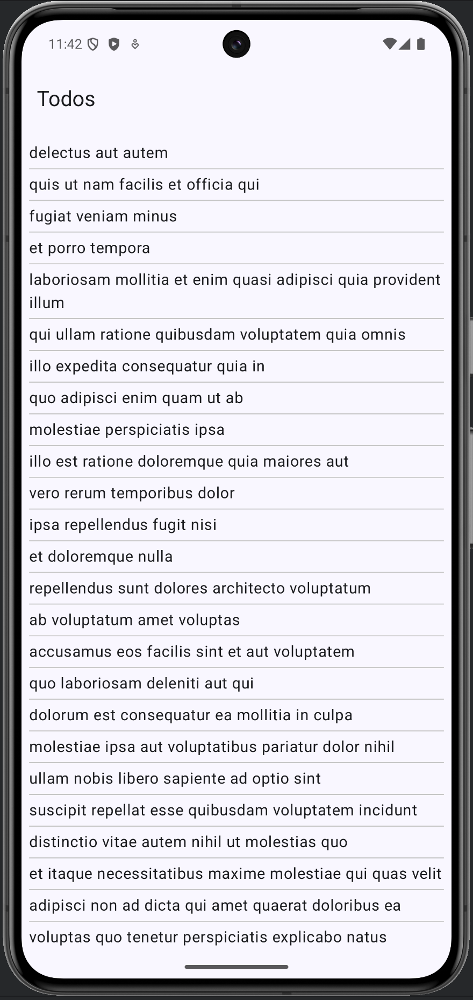

# Todo – Creating MVVM and reading API containing JSON

Todo sample app and related walkthroughs contains three parts:
1. Creating basic Todo app using hardcoded values (list) from a ViewModel class.
2. Connecting to the internet and reading JSON data using Retrofit and Gson
   libraries. Creating MVVM architecture for Android app.
3. Handling possible errors and displaying them on UI. Displaying loading message
   while data is retrived from the API service.

App will read and display data from open API available on https://jsonplaceholder.typicode.com/todos. 
Service returns list of Todo objects (containing just some random trivial generated data).

## Implemented UI

